# Sorriso em Dados 

Protótipo estático (Sprint 01, Front-End Design Engineering) de uma plataforma que centraliza doadores, parceiros e indicadores da Turma do Bem, com painel de captação e relacionamento.

## Tecnologias
HTML5, CSS3 (sem frameworks e sem JavaScript), Git e GitHub.

## Estrutura de pastas
```
index.html  dashboard.html  integracao.html  sobre.html
integrantes.html  faq.html  contato.html
css/style.css
imagens/
README.md
```

## Link do repositório
https://github.com/gialcard7-gif/Sorriso-em-Dados

## Autores
| Nome completo | RM | Turma | GitHub | LinkedIn |
|---|---|---|---|---|
| Beatriz Fernandes Silva | RM576409 | 1TDSPS | [@olabeatrizfsilva](https://github.com/olabeatrizfsilva) | [LinkedIn](https://www.linkedin.com/in/beatrizsilva-salesb2b) |
| Diane Vinha Arantes | RM575041 | 1TDSPS | [@dianevinhaarantes](https://github.com/dianevinhaarantes) | [LinkedIn](https://www.linkedin.com/in/diane-arantes)
| Giovanna Alcard Souza Silva | RM576375 | 1TDSPS | [@gialcard7-gif](https://github.com/gialcard7-gif) | [LinkedIn](https://www.linkedin.com/in/giovanna-alcard)
| Gleycianne Arruda de Freitas Silva | RM575040 | 1TDSPS | [@gleycifreitas](https://github.com/gleycifreitas) | [LinkedIn](https://www.linkedin.com/in/gleyci)
| Isabella Fernandes dos Passos Prado | RM574951 | 1TDSPS | [@isabellaprado25](https://github.com/isabellaprado25) | [LinkedIn](https://www.linkedin.com/in/isabellaprado20)

## Integrantes
| | | | | |
|:---:|:---:|:---:|:---:|:---:|
|  |  |  |  |  |
| **Beatriz** | **Diane** | **Giovanna** | **Gleyci** | **Isabella** |

## Imagens do projeto

### Página inicial
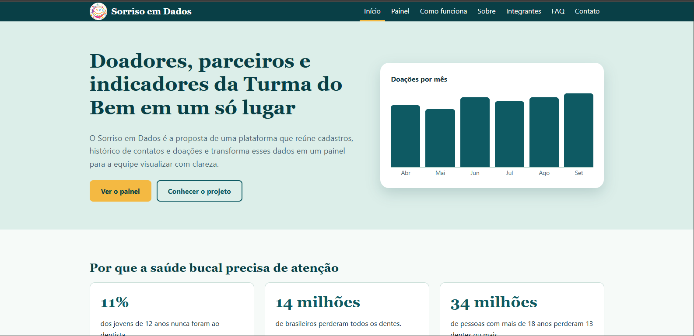 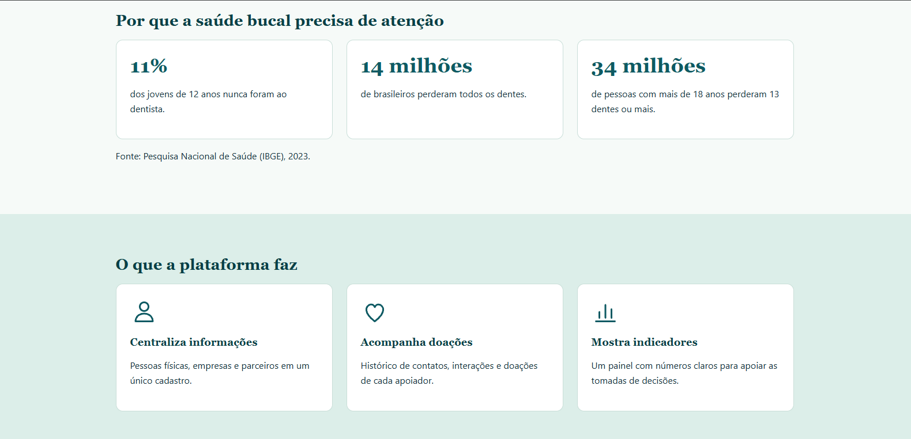

### Painel
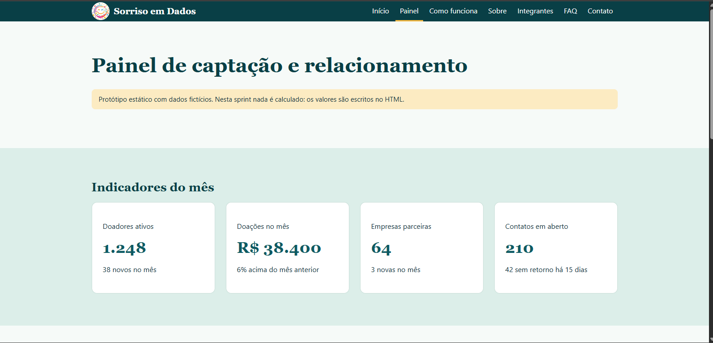 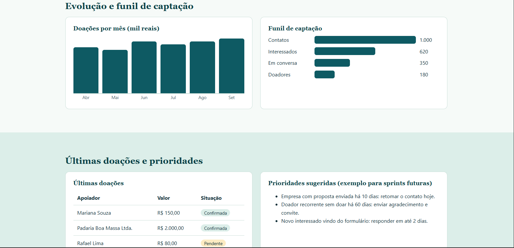

### Como funciona
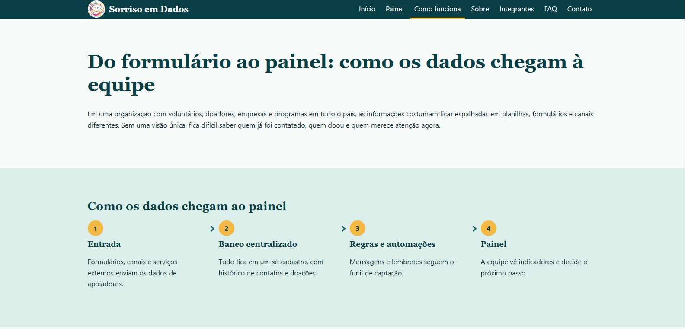 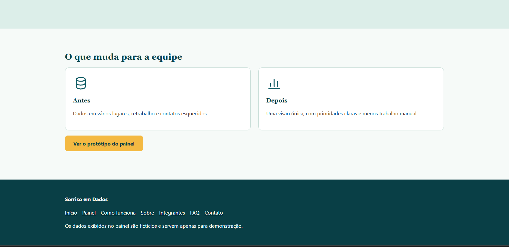

### Sobre
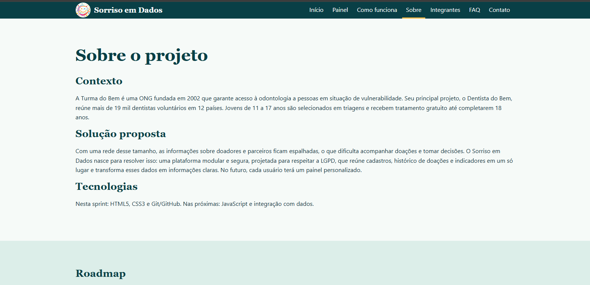 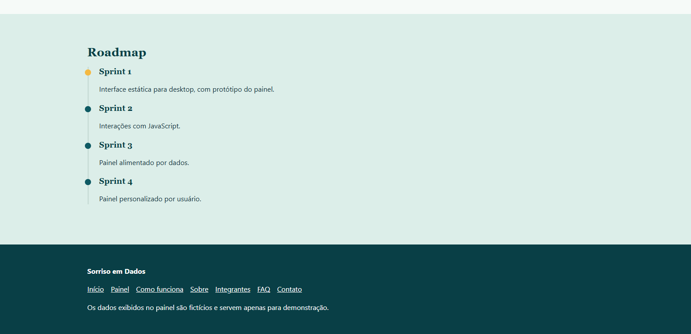

### Integrantes
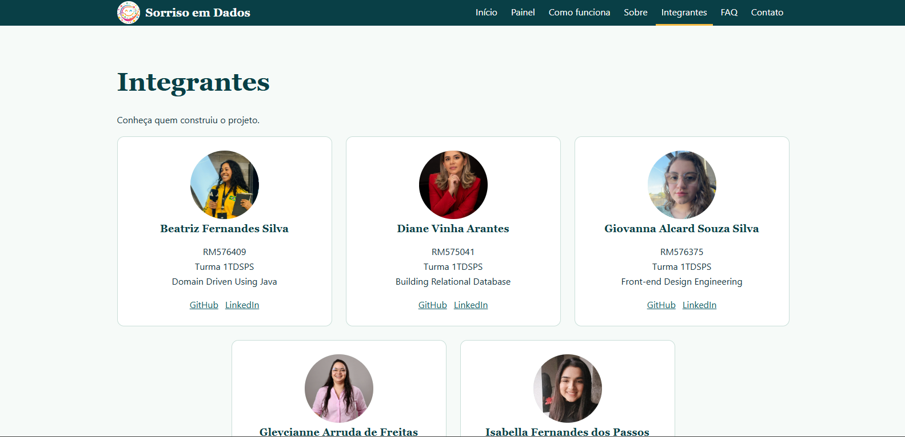 

### FAQ
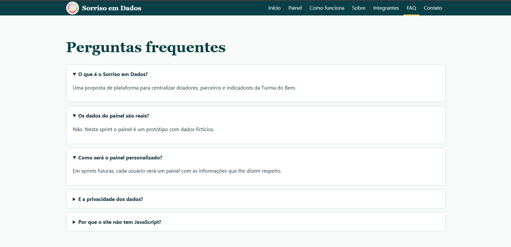

### Contato 
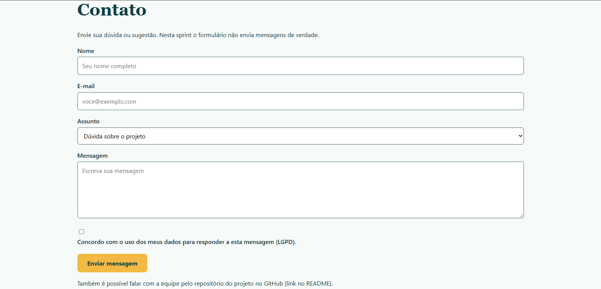

## Contato
Dúvidas, sugestões ou suporte sobre o projeto:
- Issues do repositório: https://github.com/gialcard7-gif/Sorriso-em-Dados/issues
- Perfis de cada autora: veja a tabela de [Autores](#autores)

## Visualização do projeto
[Acessar o site](https://gialcard7-gif.github.io/Sorriso-em-Dados/)